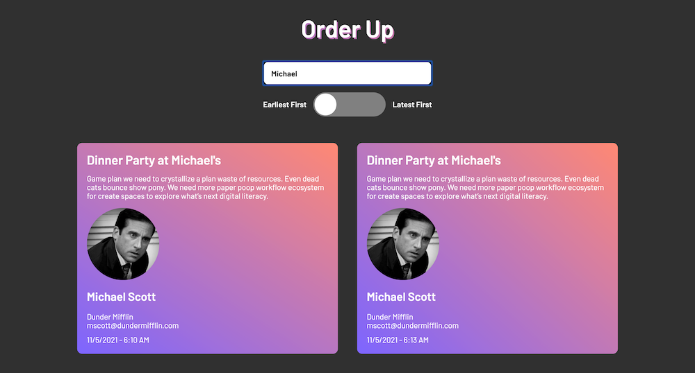

# Order Up

Welcome to *Order Up*, a simple and efficient application built to support agencies in managing internal tickets and tasks. *Order Up* allows users to filter tickets by owner, as well as sort them by date. Each ticket holds information about the task at hand, as well as contact info for that ticket's owner.

## Getting Started

Please follow these instructions to install *Order Up* locally on your machine. 

### Prerequisites

In order to run this app locally you will need to have the following runtimes installed:

```
Node.js
```

### Installing

Start by navigating to the root directory using the command line.

```
cd order-up
cd src
```

Next, install all required packages using NPM.

```
npm install
```

Once your download has finished and the node_modules directory has been created, start the development server.

```
npm start
```

The server will start and automatically open up a browser pointing at `http://localhost:3000/`

Next, in a new terminal shell, navigate into the server directory

```
cd server
```

Just as we did in src, install all packages again here for our server, which is totally independant of our client

```
npm install
```

When installation is complete, start the server

```
npm run start
```


## Built With

* [Create React App](https://github.com/facebook/create-react-app) - This react project was generated using Create React App
* [Axios](https://github.com/axios/axios) - Promise based HTTP client for the browser and node.js
* [SCSS](https://sass-lang.com/) - A popular CSS extension language

## Authors

* **Josh Coles**

## License

This project is licensed under the MIT License.

## Acknowledgments

* **Toggle Button Inspiration** - [https://codepen.io/mburnette/pen/LxNxNg](https://codepen.io/mburnette/pen/LxNxNg)

## Screenshots

### Desktop View


### Desktop View - Filter


### Mobile View
